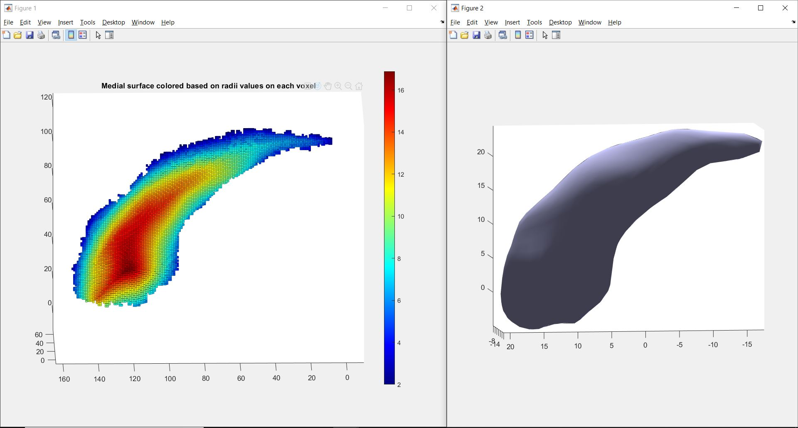
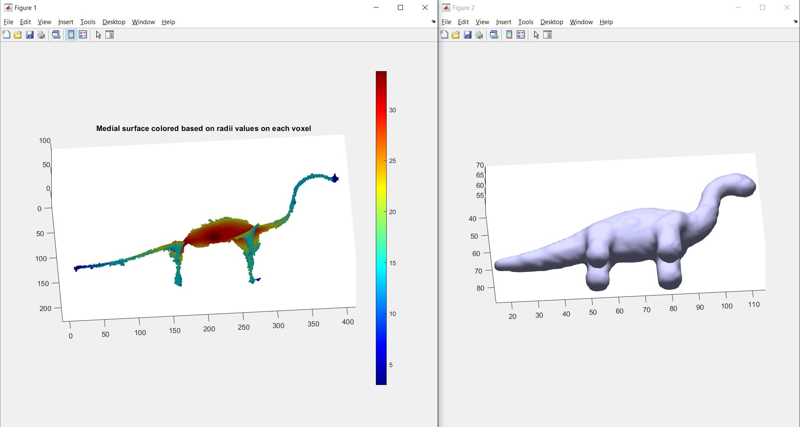

# 3D Average Outward Flux Skeletons

 


The medial axis, or topological skeleton, of an object Ω is the set of all points in Ω having more than one closest point on the object boundary, ∂Ω. This repository contains matlab code for computing the medial axis of 3D binary volumes.

This package presents many tools to read different 3D file formats such as `.vtk` , `.stl` , `.obj` and `.off`, and then it renders those 3D objects as 3D binary volume. 

A 3D binary volume is a volume (3D matrix) with only two values or colors. This code (and all examples) use the convention that the two  colors (values) are black and white, with voxl values 0 and 1 respectively.

The medial axis is only computed in white regions; i.e. Ω is considered to be all white voxels in the volume, and all black pixels are merely treated as object boundaries, or part of ∂Ω. See Usage below for more details.


## Setup

**NOTE** 

THIS CODE IS TESTED WITH MATLAB 2018b. Earlier version of MATLAB may not work with this package.
Also, Matlab Coder is a necessary toolbox to have if you want to run mex binary for faster performance.


To download the code, open a terminal and type:
```
git clone https://github.com/mrezanejad/3DAOFSkeletons.git
```
This will create a directory `3DAOFSkeletons/` containing all of the code seen here.
<br>

# Usage 


### Step 1 - Performance 
For faster performance, you may compile the `.m` matlab scripts included here to MEX binaries.

Open matlab and navigate to `3DAOFSkeletons/`. In the console, run:
```
>> compile_mex
```
This will create a folder `codegen/`, which contains auto-generate C code for the relevant `.m` files, which is then compiled to MEX.

<br>


### Step 2 - Run a demo

From the `3DAOFSkeletons/` directory, edit `demo.m` and set your `fileName`, `fileFormat`, and a specific `resolution`. Processing voxelised binary objects need a lot of RAM, therefore, resolutions above a certain cap would crash the code. 

Please note that `fileFormat` should be specified without the extension dot (e.g. `fileFormat = 'stl'`).  


To compute the medial surface a 3D object, you can simply run our matlab function `demo.m`. Navigate to the downloaded `3DAOFSkeletons/` folder and from the matlab console run:
```
>> demo
```

The medial surface and other useful datastructures that are by-product of our skeletonization algorithm would be computed from `perform_skeletonization.m` (line 19). 
<br>
 


